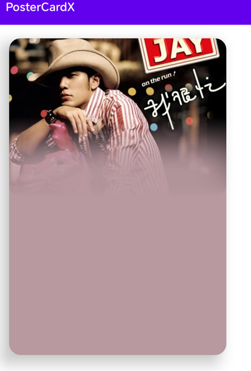

# PosterCardX

An extended view based
on [androidx.cardview.widget.CardView](https://developer.android.com/reference/kotlin/androidx/cardview/widget/CardView.html),
which generates a nice background based on a poster image.

- The inspiration comes from the need for multimedia cards to generate immersive backgrounds that
  match the album colors according to the albums of different songs.
- You can use the default configuration, or customize the background blur, gradient, crop size,
  position, etc. through parameters.
- PosterCard still has all the properties of CardView, but only adds a background, so it is very
  easy to use.

## Effect screenshots



## Implement by gradle

`implementation("com.lunacattus.postercardx:postercardx:1.0.0")`

### Use in XML

1. When using the default style, only need to pass in image resources (png, jpg) through
   `posterCardSrc`, and use CardView for the rest of the rounded corners and shadow effects.
2. In addition to local image resources, you can also pass in the URL `posterCardUrl` of an online
   image. PosterCard will use glide to load the image.

```xml
    <com.lunacattus.postercardx.PosterCard 
        android:id="@+id/poster_card" 
        android:layout_width="0dp"
        android:layout_height="0dp" 
        android:layout_marginStart="30dp" 
        app:cardCornerRadius="20dp"
        app:cardElevation="20dp" 
        app:layout_constraintBottom_toBottomOf="parent"
        app:layout_constraintHeight_percent="0.7" 
        app:layout_constraintStart_toStartOf="parent"
        app:layout_constraintTop_toTopOf="parent" 
        app:layout_constraintWidth_percent="0.3"
        app:posterCardSrc="@drawable/jay2" />
```

- Note: If the URL is http:// instead of https://, you need to
  add networkSecurityConfig yourself, otherwise glide will fail to load the image.

3. If you don't want to use the default style, the following properties are provided for
   customization:
    - `posterCardTopFraction` Set the scale of the poster to cover the top of the card.
    - `posterCardPositionBias` Set the position of the cropped poster when it covers the top of the
      card.
    - `posterCardColorExtractAreaFraction` Sets the bottom area ratio to extract colors from the
      poster.
    - `posterCardColorMinLuminance` Set the minimum luminance of the filtered color when extracting
      color.
    - `posterCardColorMaxLuminance` Set the maximum luminance of the filtered color when extracting
      color.
    - `posterCardColorSaturation` Set the saturation of the extracted color.
    - `posterCardGradientFraction` Set the percentage of the gradient color that is overlaid on the
      cropped poster,
      from bottom to top.
    - `posterCardBlurFraction` Set the percentage of the blur color that is overlaid on the cropped
      poster, from
      bottom to top.
    - `posterCardBlurTransportAlpha` Set the transparency alpha value of the cropped poster overlay
      blur color.
    - `posterCardBlurRadius` Set the blur level of the poster overlay blur color.
    - `posterCardUseLinearGradient` Set whether to use linear gradient.
    - `posterCardGradientTransportAlphaIntArray` Sets the transparency alpha value array in the
      custom gradient ladder.
    - `posterCardGradientPositionFloatArray` Sets the transparency position value array in the
      custom gradient ladder.

### Use in kotlin

1. First construct the PosterCard object, then set the properties through chain calls, and finally
   call build() to build.
2. Add the posterCard object to the container.

```kotlin
        val posterCard = PosterCard(this).apply {
    layoutParams = LayoutParams(
        LayoutParams.MATCH_PARENT,
        LayoutParams.MATCH_PARENT,
    )
}
posterCard.setPoster(R.drawable.jay4).setTopFraction(0.4f).build()
posterCard.radius = 30f //This is from CardView
binding.cardContainer.addView(posterCard)
```
## 中文介绍

这是一个基于AndroidX.CardView的扩展库, 通过传入的图片给cardview生成好看的背景, 灵感来源于车载开发中媒体播放卡片，
不同歌曲播放的时候媒体卡片背景根据不同的专辑图片发生变化，当前库的作用就是裁剪专辑图片然后提取底部合适的颜色并给图片添加渐变
模糊，最后给CardView绘制上好看的背景。

### gradle 引入

`implementation("com.lunacattus.postercardx:postercardx:1.0.0")`

### 用法

1. 直接在XML中使用，跟CardView一样，默认带有属性，只需要通过`posterCardSrc`或者`posterCardUrl`传入专辑图片即可, 
不喜欢默认的样式，可以使用提供的属性进行自定义设置, 具体属性参考上面英文介绍里的。
2. 在kotlin中动态添加，代码参考英文介绍，动态加载不同的图片时，可以直接传入图片url，库里使用了glide去加载图片，
使用http协议的图片资源时，记得在app里添加networkSecurityConfig配置，否则glide解析图片会失败。
3. 每次代码设置完新的属性或者图片时，最后调用`build()`触发重新绘制。

